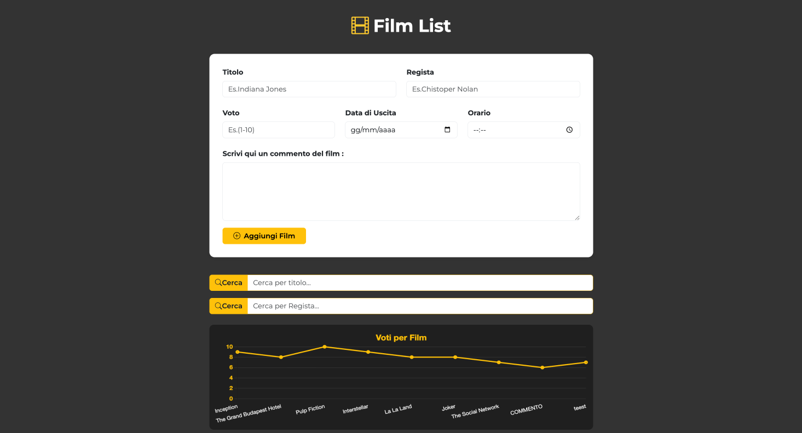
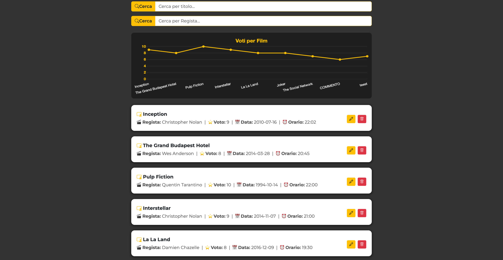
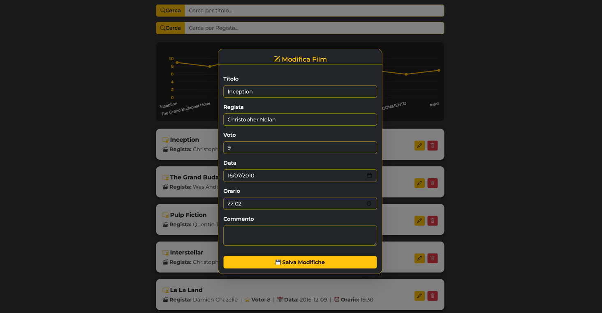
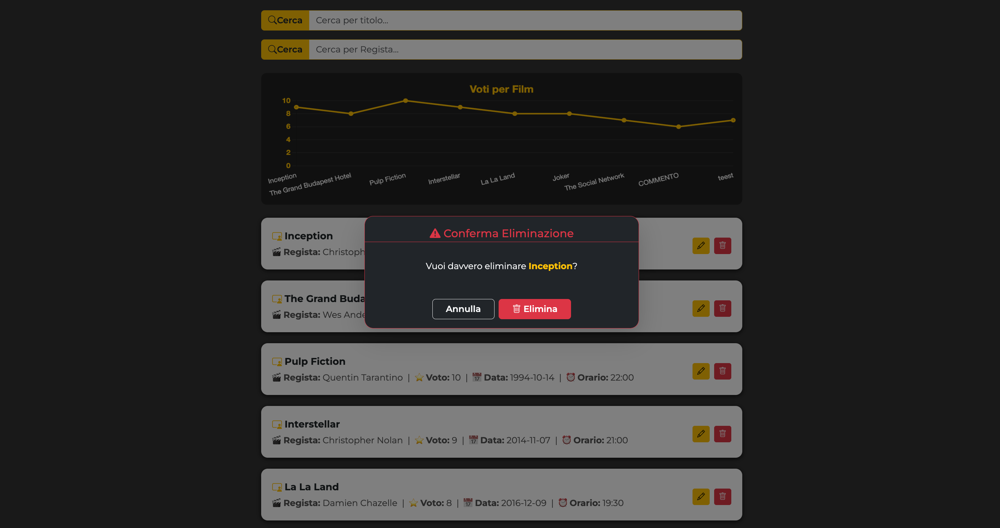

# Apllicazione Crud API di Film
Applicazione sviluppata insieme alla classe FullStack Developers
*Novembre 2025* 👩🏻‍💻

---

---

⚒️

| Nome | Linguaggio | Versione |
|------|------------|----------|
| HTML |Markup      | 5        |
| CSS  |Style       | 4        |
| Java |Logic       | ES7      |
| Node |Backend     | 22.20    |

cd ./refactoring

npm install

npm run start

Avviare Golive da VSCode per la parte frontEnd
